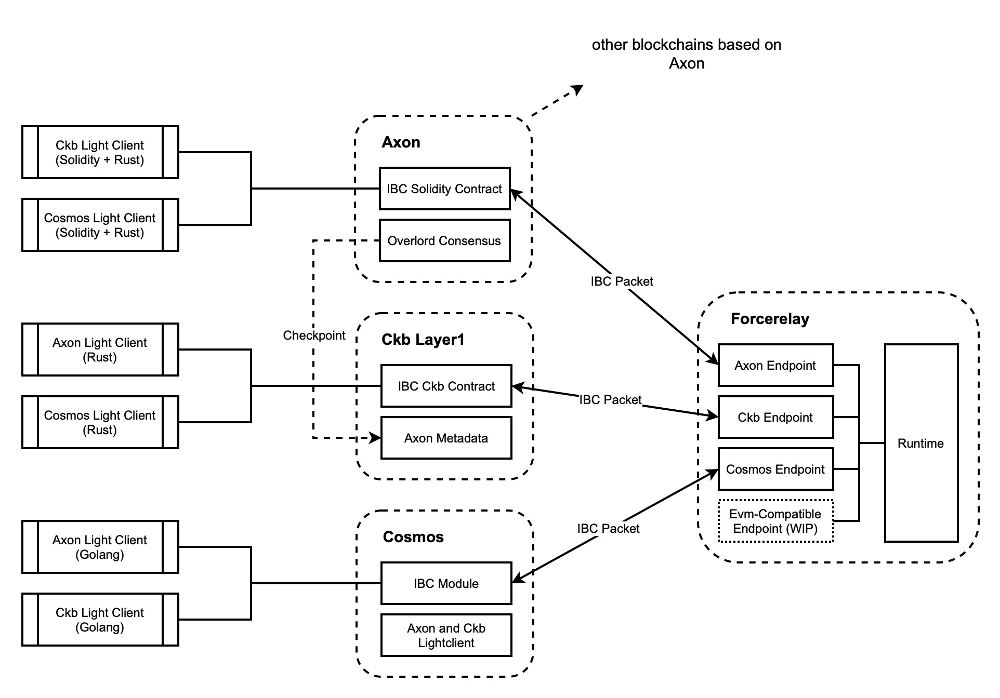

# Forcerelay

[](LICENSE)


Forcerelay is an IBC-Compatible bridge that aims to open up the Nervos ecosystem and the Cosmos ecosystem, and it also serves as a standard cross-chain solution within the Nervos ecosystem.

Forcerelay is built on [Hermes](https://github.com/informalsystems/hermes), this means we will keep continue to track and update the latest version of Hermes, and won't stop it on any specific old version.

At present, Forcerelay exclusively supports Axon, CKB, and Cosmos-SDK chains, prioritizing their seamless operation. While it currently doesn't encompass other well-established EVM chains, such as Ethereum, Arbitrum, and BSC, this is primarily due to the intricacies of running a light-client from these chains on EVM. Nevertheless, our roadmap includes plans for implementing mainstream EVM chains, and we'll keep you informed on our progress in this regard.

## Progress Tracking
Forcerelay is actively under development, and we welcome any issues and pull requests. Here's an overview of our current progress:
- [x] Implement connection and channel layer of IBC protocol between Axon and CKB
- [ ] Upgrade the underline Hermes from v1.4.0 to the latest v1.6.0
- [ ] Implement packet layer of IBC protocol between Axon and CKB
- [ ] Implement entire IBC protocol between Axon and Cosmos-SDK chains
- [ ] Implement entire IBC protocol between CKB and Cosmos-SDK chains

## Architecture Design
Cosmos IBC is a cross-chain protocol designed based on light-client technology. In case of homogeneous chains, it's supposed to implement only one light-client module to run the protocol. However, in case of Forcerelay, chains are non-homogeneous, so we have to implement at least three light-client modules to run IBC protocol between Axon, CKB and Cosmos.

Contract development environment is sensitive to the blockchain's VM implementation, which means the different VM implementation requires us to provide different light-client solutions, even the solutions come from the same blockchain.

High level diagram of Forcerelay:


## Usage Guidance
Take the IBC cross-chain betwwen Axon and CKB as an example.

### Contract Deployment on Axon
Before deploying [ibc-solidity-contract](https://github.com/synapseweb3/ibc-solidity-contract) on Axon, please make sure Node.js and Yarn are installed:

```
$ git clone https://github.com/synapseweb3/ibc-solidity-contract
$ cd ibc-solidity-contract
$ echo AXON_HTTP_RPC_URL="YOUR_AXON_URL" > .env
$ yarn migrate > migrate.log | tail -f migrate.log
```

After running `yarn migrate`, the `OwnableIBCHandler` address is listing in console, we record it and mark as **`YOUR_IBC_AXON_ADDRESS`** to use later.

### Contract Deployment on CKB
Detailed deployment steps can be found in [ibc-ckb-contracts](https://github.com/synapseweb3/ibc-ckb-contracts). Alternatively, you can find pre-deployed contracts TYPE_ARGS on both testnet and mainnet:
||Mainnet|Testnet|
|-|-|-|
|connection|WIP|WIP|
|channel|WIP|WIP|
|packet|WIP|WIP|
|utility|WIP|WIP|
|escrow|WIP|WIP|

### Business Module Registration
When deploying the Solidity contract on Axon, an initial ICS20 transfer module is automatically registered in `OwnableIBCHandler` on port `port-0` during the contract migration process. This registration is open to all users. For detailed instructions on how to register your own business module, visit [ibc-solidity-contract](https://github.com/synapseweb3/ibc-solidity-contract) repository.

Unlike Axon, business modules cannot be registered directly with a contract on CKB. To address this, we have introduced [forcerelay-ckb-sdk](https://github.com/synapseweb3/forcerelay-ckb-sdk), designed to facilitate the distribution and calling of custom modules.

It's important to note that the IBC port on CKB corresponds to the `LOCK_HASH` of your wallet cell on CKB, which we will refer to as `WALLET_LOCK_HASH` for future use.

### Installation and Setting
We recommand you to download the pre-compiled binary, or you can compile mannully from the source code, which requires `Rust ^v1.56.0` installed:

```
$ git clone https://github.com/synapseweb3/forcerelay
$ cd forcerelay
$ cargo install -p ibc-relayer-cli
$ forcerelay --version
```

Forcerelay can be executed by specifying a configuration file in the command line, otherwise it will access the `~/.hermes/config.toml`. We provide a pre-generated [example](https://github.com/synapseweb3/forcerelay/blob/main/config.toml) configuration file written for Axon and CKB (Testnet). To run Forcerelay, only minimal modifications are needed to this configuration:

```
websocket_addr = "ws://<YOUR_AXON_URL>:<WS_PORT>"
rpc_addr = "http://<YOUR_AXON_URL>:<HTTP_PORT>/"
contract_address = "<YOUR_IBC_AXON_ADDRESS>"
```

### Import Secret Key
Before running Forcerelay, accounts should be prepared on both blockchain networks and imported accordingly. In the case of Axon and CKB, Forcerelay needs its own Axon and CKB accounts with a sufficient amount of token balance. Follow these steps to import Secp256k1 secret keys:

```
$ forcerelay keys add --chain axon-0 --secret-file <SECRET_KEY_PATH>
$ forcerelay keys add --chain ckb4ibc-0 --secret-file <SECRET_KEY_PATH>
```

### Connect and Start Forcerelay
Establishing IBC channels on both sides of Axon and CKB is required to run Forcerelay:

```
$ forcerelay create channel \
    --a-chain axon-0 --b-chain ckb4ibc-0 \
    --a-port  port-0 --b-port <WALLET_LOCK_HASH> \
    --new-client-connection
$ forcerelay start --config <YOUR_CONFIG_PATH>
```